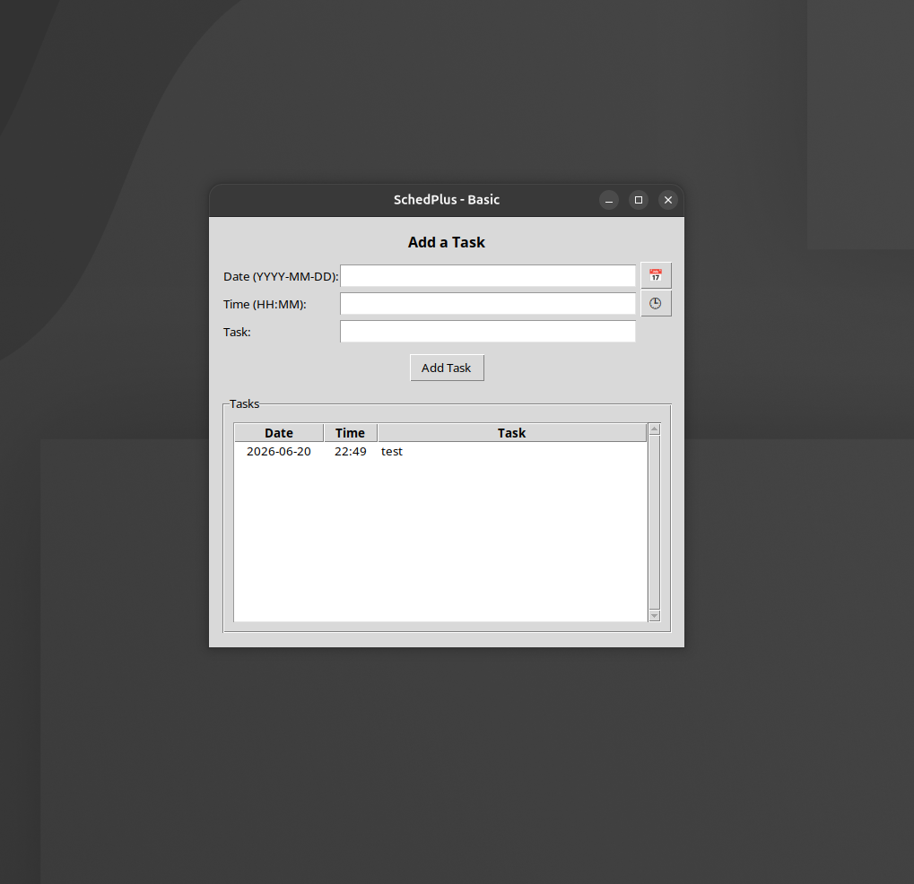
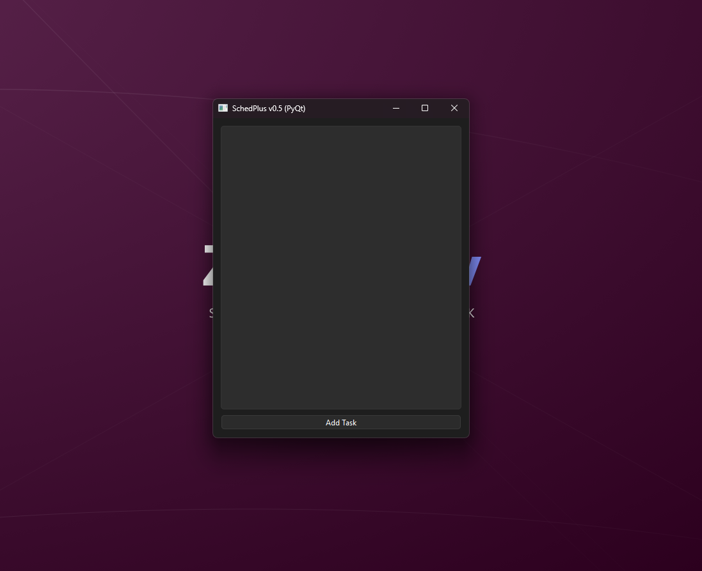

<div align="center">

# SchedPlus

### A modern, local-first scheduler for Windows and Linux

[Documentation](https://docs.zford.dev/zforddev/schedplus/) · [Downloads](https://github.com/ZFordDev/SchedPlus/releases) · [Report a bug](https://github.com/ZFordDev/SchedPlus/issues/new/choose)

[](https://github.com/ZFordDev/SchedPlus)
[](#installation)
[](https://github.com/ZFordDev/SchedPlus/releases)
[](LICENSE)
[](LICENSES/Apache-2.0.txt)

</div>

SchedPlus gives you a focused place to organise tasks and plan your time without unnecessary friction. It is local-first, offline-friendly, and growing into a broader scheduling platform with calendars, reminders, syncing, and accounts on the roadmap.

<p align="center">
  
  
</p>

## Features

- **Local task management** for creating, viewing, updating, and deleting scheduled tasks
- **Native calendar workspace** with month, week, and day planning views
- **Calendar scheduling** with click-to-create, task editing, and drag-to-reschedule workflows
- **SQLite persistence** stored in the platform-appropriate user data directory
- **Offline-friendly workflow** with task data kept on your computer
- **Multiple interfaces** including lightweight Tkinter, the advanced PyQt task workspace, and a scriptable CLI
- **Cross-platform foundation** targeting Windows and Linux
- **Shared scheduling core** that keeps persistence and interface code separated

## Installation

Packaged releases are planned. Until installers are available, install SchedPlus from source:

```bash
git clone https://github.com/ZFordDev/SchedPlus.git
cd SchedPlus

python -m venv .venv
source .venv/bin/activate
pip install -e ".[full]"

schedplus
```

On Windows, activate the virtual environment with `.venv\Scripts\activate` before running the remaining commands.

SchedPlus can also be installed with only the dependencies needed by a specific
interface:

```bash
pip install -e .             # Core scheduler, updater, and CLI
pip install -e ".[lite]"      # Core plus the lightweight Tkinter interface
pip install -e ".[standard]"  # Core plus the advanced PyQt interface
pip install -e ".[full]"      # Every supported interface
```

Tkinter itself is supplied by Python or your operating system; the `lite` extra
adds `tkcalendar`. On some Linux distributions, a package such as `python3-tk`
must be installed separately.

## Usage

Run `schedplus` without an option to open the interface selector, or launch an interface directly:

```bash
schedplus         # Open the interface selector
schedplus --tk    # Launch the Tkinter interface
schedplus --py    # Launch the PyQt interface
```

Tasks can also be managed directly from a terminal without launching a UI:

```bash
# Create a task
schedplus add "Buy milk" --date 2026-08-03 --time 14:00

# List tasks, optionally changing their order
schedplus list
schedplus list --sort time --descending

# Edit a task using its full ID or an unambiguous ID prefix
schedplus edit 7c94a2 --text "Buy milk and bread" --time 15:00

# Delete a task
schedplus delete 7c94a2

# Inspect updater state (self-updating packaged builds only)
schedplus update status
schedplus update check
```

All commands use the same validation and SQLite backend as the desktop
interfaces. Validation and database failures are written to stderr, and each
command returns a process-friendly exit status. Run `schedplus --help` or
`schedplus COMMAND --help` for complete options.

Non-Store packaged builds can check for verified updates in the background and
offer to restart after a release is ready. Store packages use their Store's
update service instead. Self-updating is intentionally disabled for source
checkouts, so development files are never replaced automatically.

## System requirements

- Python 3.10 or later
- Windows 10 or later, or a modern Linux distribution
- Tkinter for the Tkinter interface
- A desktop environment for graphical modes

_macOS is not currently supported._

## Build from source

You will need Python 3.10 or later, pip, and Git. Tkinter may need to be installed through your operating system's package manager.

```bash
git clone https://github.com/ZFordDev/SchedPlus.git
cd SchedPlus
python -m venv .venv
source .venv/bin/activate
pip install -e ".[dev]"
```

The development profile includes both desktop interfaces along with the test,
formatting, and linting tools.

## Project status and roadmap

SchedPlus is actively developed and open to contributions. Current work is focused on strengthening the desktop experience and expanding SchedPlus beyond task management into a complete scheduling platform.

Planned areas include:

- Reminders and notifications
- Optional syncing across devices
- Accounts for sync and connected features
- Improved task management workflows
- Cross-platform installers and packaged releases
- Continued development of the PyQt interface

Development priorities evolve with user feedback. Follow the live project trackers for current plans:

- [Open issues and planned improvements](https://github.com/ZFordDev/SchedPlus/issues)
- [Latest releases and release notes](https://github.com/ZFordDev/SchedPlus/releases)
- [Contributing guide](CONTRIBUTING.md)

## Known limitations

- Advanced calendar features such as recurring events and categories are not yet available.
- Packaged installers are not yet available.
- Syncing, accounts, and reminders are planned features and are not yet available.
- macOS is not currently supported.

## Support and contributing

Bug reports, feature ideas, documentation improvements, and code contributions are welcome. Read [CONTRIBUTING.md](CONTRIBUTING.md) before submitting a change, and use the [issue tracker](https://github.com/ZFordDev/SchedPlus/issues) for bugs and suggestions.

Security vulnerabilities should be reported using the process in [SECURITY.md](SECURITY.md), not through a public issue.

If SchedPlus is useful to you, starring the repository or sharing the project also helps.

## License

SchedPlus uses a clear licensing boundary:

- The complete native desktop application is licensed under
  [GPL-3.0-only](LICENSE). This includes the distributed application that uses
  GPL-licensed PyQt6.
- The reusable scheduler, validation, task model, and storage modules under
  `src/logic` are separately available under the
  [Apache License 2.0](LICENSES/Apache-2.0.txt).
- Third-party dependencies remain governed by their respective licenses.

Releases through version 0.7.3 used a blanket MIT license. The final source
available entirely under those terms is preserved in the
[`release-0.7.3`](https://github.com/ZFordDev/SchedPlus/tree/release-0.7.3)
tag, and the historical [MIT license text](LICENSES/MIT.txt) remains included
for attribution and reference. See [NOTICE](NOTICE) for the complete licensing
and transition notice.

## About

SchedPlus is part of the ZFordDev ecosystem, a collection of focused tools built for clarity, practical use, and long-term maintainability. It is built and maintained by [ZFordDev](https://github.com/ZFordDev).
